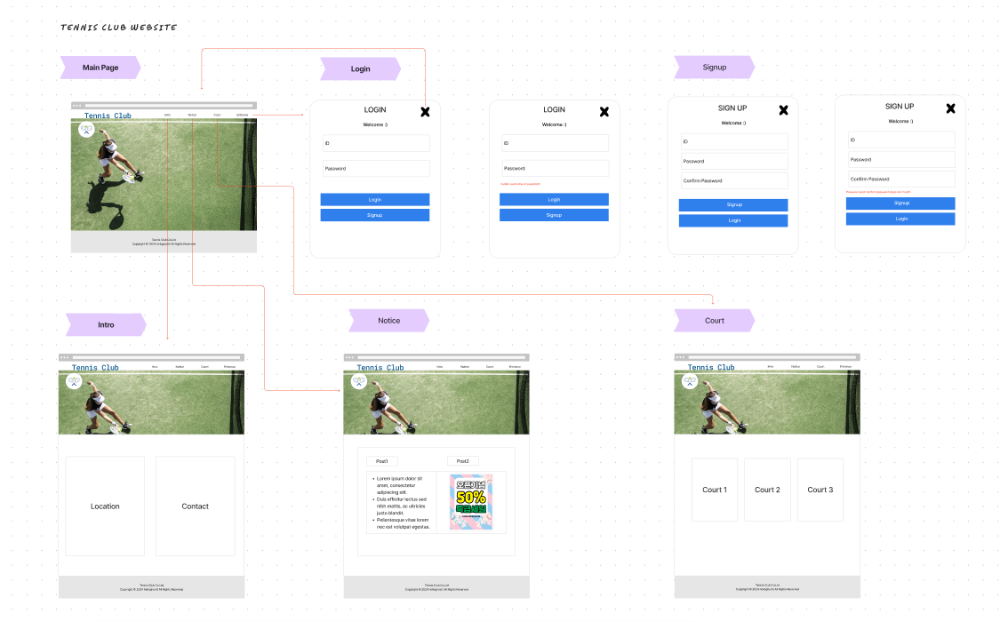
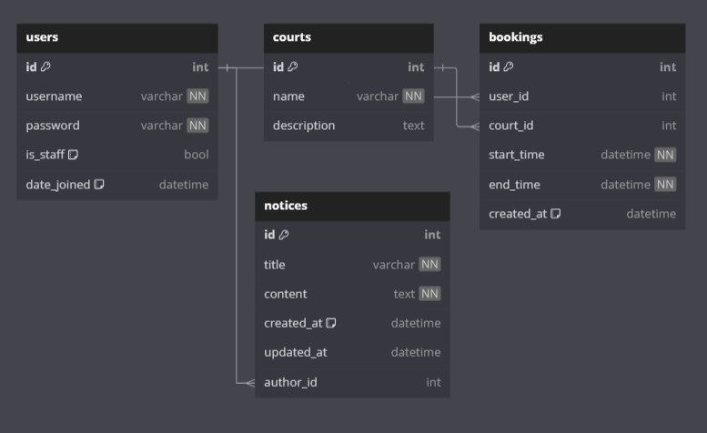

# be-booking_system

#테니스 레슨 예약시스템

## 1. 프로젝트 목표 및 범위
레슨 예약 시스템으로 관리자와 회원을 타겟 사용자로 하여 권한 및 역할을 설정하였습니다.
테니스 클럽을 중점에 두고 만들었으나 요가 스튜디오나 회의실 예약 등으로 변경 가능합니다.  


## 2. 기술 스택 및 배포 환경
backend, frontend : Django, Html, CSS, JavaScript, React
cloud service : AWS Lightsail, GitHub


## 3. github repo, url 생성
Backend repo :  https://github.com/helloghostt/be-booking_system <br>
Frontend repo :  https://github.com/helloghostt/fe-booking_system <br>
url : 

	superuser
	
	admin-park
	helloghostt1@gmail.com
	park1234!

## 4. WBS 작성 - 업무 분류 체계


## 5. 와이어프레임 작성




## 6. ERD 작성


```
erDiagram
    USERS {
        int id PK "primary key"
        varchar username "not null, unique"
        varchar password "not null"
        varchar email "not null, unique"
        bool is_staff "default: false"
        datetime date_joined "default: now()"
    }

    PROFILES {
        int id PK "primary key"
        int user_id FK "foreign key to USERS.id"
        varchar first_name
        varchar last_name
        varchar phone_number
        varchar address
    }

    COURTS {
        int id PK "primary key"
        varchar name "not null"
        varchar location
        varchar availability
        text description
    }

    BOOKINGS {
        int id PK "primary key"
        int user_id FK "foreign key to USERS.id"
        int court_id FK "foreign key to COURTS.id"
        date date "not null"
        time time_slot "not null"
        datetime created_at "default: now()"
    }

    NOTICES {
        int id PK "primary key"
        varchar title "not null"
        text content "not null"
        datetime created_at "default: now()"
        datetime updated_at
        int author_id FK "foreign key to PROFILES.id"
    }

    BLOGS {
        int id PK "primary key"
        varchar title "not null"
        text content "not null"
        datetime created_at "default: now()"
        datetime updated_at
        int author_id FK "foreign key to PROFILES.id"
    }

    COMMENTS {
        int id PK "primary key"
        int blog_id FK "foreign key to BLOGS.id"
        int author_id FK "foreign key to PROFILES.id"
        text content "not null"
        datetime created_at "default: now()"
    }

    USERS ||--o{ PROFILES : "user_id"    // User와 Profile 1:1 관계
    PROFILES ||--o{ BOOKINGS : "user_id" // Profile과 Booking 1:N 관계
    COURTS ||--o{ BOOKINGS : "court_id" // Court와 Booking 1:N 관계
    PROFILES ||--o{ NOTICES : "author_id" // Profile과 Notice 1:N 관계
    PROFILES ||--o{ BLOGS : "author_id" // Profile과 Blog 1:N 관계
    BLOGS ||--o{ COMMENTS : "blog_id" // Blog와 Comment 1:N 관계
    PROFILES ||--o{ COMMENTS : "author_id" // Profile과 Comment 1:N 관계

```
## 7. 폴더구조
	   backend/
	    ├── tennisproject/
	    │   ├── __init__.py
	    │   ├── asgi.py
	    │   ├── settings.py
	    │   ├── urls.py
	    │   └── wsgi.py
	    ├── accounts/
	    │   ├── migrations/
	    │   ├── __init__.py
	    │   ├── admin.py
	    │   ├── apps.py
	    │   ├── models.py
	    │   ├── serializers.py
	    │   ├── tests.py
	    │   ├── urls.py
	    │   └── views.py
	    ├── courts/
	    │   ├── migrations/
	    │   ├── __init__.py
	    │   ├── admin.py
	    │   ├── apps.py
	    │   ├── models.py
	    │   ├── serializers.py
	    │   ├── tests.py
	    │   ├── urls.py
	    │   └── views.py
	    ├── bookings/
	    │   ├── migrations/
	    │   ├── __init__.py
	    │   ├── admin.py
	    │   ├── apps.py
	    │   ├── models.py
	    │   ├── serializers.py
	    │   ├── tests.py
	    │   ├── urls.py
	    │   └── views.py
	    ├── notices/
	    │   ├── migrations/
	    │   ├── __init__.py
	    │   ├── admin.py
	    │   ├── apps.py
	    │   ├── models.py
	    │   ├── serializers.py
	    │   ├── tests.py
	    │   ├── urls.py
	    │   └── views.py
	    ├── blog/
	    │   ├── migrations/
	    │   ├── __init__.py
	    │   ├── admin.py
	    │   ├── apps.py
	    │   ├── models.py
	    │   ├── serializers.py
	    │   ├── tests.py
	    │   ├── urls.py
	    │   └── views.py
	    └── manage.py
  
    Frontend/
    ├── src/
    │   ├── components/
    │   │   ├── accounts/ 계정 관련 컴포넌트 (로그인 폼, 회원가입 폼, 프로필)
    │   │   │   ├── LoginForm.js
    │   │   │   ├── SignupForm.js
    │   │   │   └── Profile.js
    │   │   ├── bookings/ 예약 관련 컴포넌트 (코트 목록, 예약 폼, 예약 내역)
    │   │   │   ├── CourtList.js
    │   │   │   ├── BookingForm.js
    │   │   │   └── BookingHistory.js
    │   │   ├── notices/ 공지사항 관련 컴포넌트 (공지사항 목록, 상세보기, 작성 폼)
    │   │   │   ├── NoticeList.js
    │   │   │   ├── NoticeDetail.js
    │   │   │   └── NoticeForm.js
    │   │   ├── common/ 공통 컴포넌트 
    │   │   │   ├── Header.js
    │   │   │   ├── Footer.js
    │   │   │   └── Navigation.js
    │   │   ├── blog/
    │   │   │   ├── BlogList.js
    │   │   │   ├── BlogForm.js
    │   │   │   └── BlogDetail.js
    │   │   └── intro/ 소개 페이지 컴포넌트
    │   │       └── Intro.js
    │   ├── pages/ 각 페이지를 나타내는 컴포넌트 폴더
    │   │   ├── Home.js
    │   │   ├── Login.js
    │   │   ├── Signup.js
    │   │   ├── Booking.js
    │   │   ├── Blog.js
    │   │   ├── Notice.js
    │   │   └── Intro.js
    │   ├── api/
    │   │   ├── auth.js  인증 관련 API 호출 함수
    │   │   ├── bookings.js  예약 관련 API 호출 함수
    │   │   ├── blog.js
    │   │   └── notices.js  공지사항 관련 API 호출 함수
    │   ├── styles/
    │   │   ├── global.css
    │   │   └── theme.js
    │   ├── App.js
    │   └── index.js
    ├── public/
    │   ├── index.html
    │   └── favicon.ico
    └── package.json 


## 8. URL 구조 및 페이지별 상세
|URL|페이지 설명|GET|POST|PUT|DELETE|로그인 권한|작성자 권한|
|------|---|:---:|:---:|:---:|:---:|:---:|:---:|
|/|메인 페이지|✔️| | | | | |
|/admin|Django 관리자 페이지|✔️| | | |관리자|관리자|
|/accounts/login|로그인 페이지|✔️|✔️| | | | |
|/accounts/signup|회원가입 페이지|✔️|✔️| | | | |
|/accounts/profile|프로필 페이지|✔️| |✔️| |회원|회원 본인|
|/intro|클럽 소개 페이지|✔️| | | | | |
|/courts/|예약하기 페이지 (코트 선택)|✔️| | | |회원| |
|/bookings/create|예약 페이지|✔️|✔️| | |회원|회원 본인|
|/notices|커뮤니티 페이지 (공지사항 목록)|✔️| | | | | |
|/notices/:id|공지사항 상세 페이지|✔️| | | | | |
|/notices/create|공지사항 작성 페이지|✔️|✔️| | |관리자|관리자|
|/notices/:id/edit|공지사항 수정 페이지|✔️| |✔️| |관리자|관리자|
|/notices/:id/delete|공지사항 삭제| | | |✔️|관리자|관리자|
|/blog|자유게시판 페이지 (게시글 목록)|✔️| | | | | |
|/blog/:id|게시글 상세 페이지|✔️| | | | | |
|/blog/create|게시글 작성 페이지|✔️|✔️| | |회원|회원 본인|
|/blog/:id/edit|게시글 수정 페이지|✔️| |✔️| |회원|게시글 작성자|
|/blog/:id/delete|게시글 삭제| | | |✔️|회원|게시글 작성자|
|/blog/:id/comments|댓글 목록|✔️|✔️| | | | |
|/blog/:id/comments/:commentId|댓글 상세|✔️| |✔️|✔️|회원|댓글 작성자|

	1) 메인 페이지 구현
	- url : `/`
	- React에서 메인 페이지 컴포넌트를 생성하고, 클럽 소개, 커뮤니티, 예약하기, 입장하기 버튼을 배치
	- 버튼 클릭 시 해당 페이지로 이동하는 라우팅을 설정합니다.
	
	2) Django admin
	- url : `/admin`
	- 코트별 시간대 설정, 회원 관리
	
	3) 로그인 페이지
	- url : `/accounts/login`
	- 입력값은 id, password 
	- 메인페이지에서 입장하기를 누르면 로그인페이지로 이동
	- React에서 로그인 폼을 생성하고, 사용자로부터 아이디와 비밀번호를 입력받습니다.
	- 중복 아이디 검증, 이메일 및 아이디 형식 검증을 수행합니다.
	- Django에서 사용자 인증을 처리하는 API를 구현하고, 로그인 성공 시 토큰을 발급합니다.
	- 로그인 성공 후 메인 페이지로 리디렉션하고, 입장하기 버튼을 프로필 버튼으로 변경합니다.
	
	4) 회원가입 페이지
	- url : `/accounts/signup`
	- 입력값은 id, password, confirm password
	- 회원가입 성공하면 로그인 페이지로 리디렉션
	
 	5)프로필 페이지
        - url : `/accounts/profile`
	- React에서 프로필 페이지 컴포넌트를 생성하고, 사용자 정보를 표시합니다.
        - password 변경 기능, booking list 확인 기능, 로그아웃 기능
    	
	6) 클럽 소개 페이지
	- url: `/intro`
	- 클럽에 대한 간단한 소개가 있고 아래에 위치와 연락처 표시
	- 위치에 Google Map API 연동
	- 연락처에는 이메일 보내기 기능(title, context, email을 쓰는 form이 있고 send버튼을 누르면 저장된 회사이메일로 발송)
	
	7) 예약하기 페이지
	- url : `/courts/`
	- React에서 코트 선택 페이지 컴포넌트를 생성하고, 사용 가능한 코트 목록을 표시
	- 코트 선택 시 예약 페이지로 이동하는 라우팅을 설정
	
	8) 예약 페이지
	- url : `/bookings/create`
	- 날짜 선택하고 시간에 따른 클래스 선택하여 예약
	- 예약 버튼 클릭 시 Django 서버로 예약 정보를 전송하고, 예약 성공 팝업을 표시
	- 예약 성공 시 사용자의 프로필 페이지에 예약 내역을 추가
	
	9) 커뮤니티 페이지
	- url : `/notices`
	- 공지사항, 자유게시판 선택 버튼
	- 관리자만 이벤트 등의 글을 작성, 수정, 삭제
	- 회원은 글을 읽기만 가능
	
	10) 자유게시판 페이지
	- url : `/blog`
	- 로그인 한 회원은 자신의 글만 작성, 수정, 삭제
	- 게시글 작성: 제목, 내용, 이미지(미디어)입력받고 작성자, 업데이트시간 표시
	- 게시글과 댓글에 대한 CRUD기능 구현


## 9. 생각
* 간단한 기능 구현이지만 백엔드 프론트엔드를 나눠서 구조화하는 것이 아직 어려웠고 TDD등 여러가지를 생각하다보니 꼬임
* 배포에 대한 학습이 많이 필요
* SSL 인증서: Let's Encrypt까지 하려고 했으나 시간부족


## 10. 트러블슈팅
* onedrive환경에서 압축하다가 취소 -> 삭제되었는데 일부는 찾음음
* 백엔드 프론트엔드 연결

