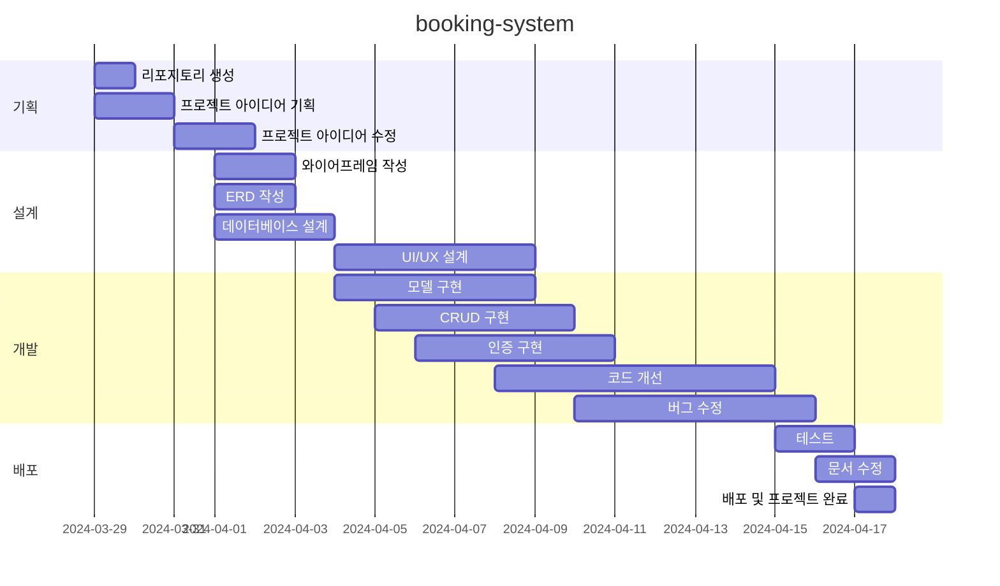

#테니스 레슨 예약시스템

## 1. 프로젝트 목표 및 범위
레슨 예약 시스템으로 관리자와 회원을 타겟 사용자로 하여 권한 및 역할을 설정하였습니다.
테니스 클럽을 중점에 두고 만들었으나 요가 스튜디오나 회의실 예약 등으로 변경 가능합니다.  

## 2. 기술 스택 및 개발 환경
Django, Html, CSS
Visual Studio Code

## 3. github repo, url 생성
repo :m
url : 

superuser

admin-park
helloghostt1@gmail.com
park1234!

## 4. WBS 작성 - 업무 분류 체계

## 5. 와이어프레임 작성

## 6. ERD 작성

be/
  ├── tennisproject/
  │   ├── __init__.py
  │   ├── asgi.py
  │   ├── settings.py
  │   ├── urls.py
  │   ├── views.py
  │   └── wsgi.py
  ├── accounts/
  │   ├── migrations/
  │   ├── __init__.py
  │   ├── admin.py
  │   ├── apps.py
  │   ├── models.py
  │   ├── urls.py
  │   └── views.py
  ├── courts/
  │   ├── migrations/
  │   ├── __init__.py
  │   ├── admin.py
  │   ├── apps.py
  │   ├── models.py
  │   ├── urls.py
  │   └── views.py
  ├── bookings/
  │   ├── migrations/
  │   ├── __init__.py
  │   ├── admin.py
  │   ├── apps.py
  │   ├── models.py
  │   ├── urls.py
  │   └── views.py
  ├── notices/
  │   ├── migrations/
  │   ├── __init__.py
  │   ├── admin.py
  │   ├── apps.py
  │   ├── models.py
  │   ├── urls.py
  │   └── views.py
  ├── templates/
  │   ├── base.html
  │   ├── accounts/
  │   ├── bookings/
  │   ├── notices/
  │   ├── index.html
  │   └── intro.html
  ├── media/
  ├── static/
  │   ├── css/
  │   ├── js/
  │   └── images/
  └── manage.py
  
  fe/
  ├── src/
  │   ├── components/
  │   │   ├── accounts/ 계정 관련 컴포넌트 (로그인 폼, 회원가입 폼, 프로필)
  │   │   │   ├── LoginForm.js
  │   │   │   ├── SignupForm.js
  │   │   │   └── Profile.js
  │   │   ├── bookings/ 예약 관련 컴포넌트 (코트 목록, 예약 폼, 예약 내역)
  │   │   │   ├── CourtList.js
  │   │   │   ├── BookingForm.js
  │   │   │   └── BookingHistory.js
  │   │   ├── notices/ 공지사항 관련 컴포넌트 (공지사항 목록, 상세보기, 작성 폼)
  │   │   │   ├── NoticeList.js
  │   │   │   ├── NoticeDetail.js
  │   │   │   └── NoticeForm.js
  │   │   ├── common/ 공통 컴포넌트 
  │   │   │   ├── Header.js
  │   │   │   ├── Footer.js
  │   │   │   └── Navigation.js
  │   │   └── intro/ 소개 페이지 컴포넌트
  │   │       └── Intro.js
  │   ├── pages/ 각 페이지를 나타내는 컴포넌트 폴더
  │   │   ├── Home.js
  │   │   ├── Login.js
  │   │   ├── Signup.js
  │   │   ├── Booking.js
  │   │   ├── Notice.js
  │   │   └── Intro.js
  │   ├── api/
  │   │   ├── auth.js  인증 관련 API 호출 함수
  │   │   ├── bookings.js  예약 관련 API 호출 함수
  │   │   └── notices.js  공지사항 관련 API 호출 함수
  │   ├── styles/
  │   │   ├── global.css
  │   │   └── theme.js
  │   ├── App.js
  │   └── index.js
  ├── public/
  │   ├── index.html
  │   └── favicon.ico
  └── package.json 
  -->

## 8. URL 구조 및 페이지별 상세
|URL|페이지 설명|GET|POST|PUT|DELETE|로그인 권한|작성자 권한|
|------|---|:---:|:---:|:---:|:---:|:---:|:---:|
|/|메인 페이지|✔️| | | | | |
|/admin/|관리자 페이지|✔️| | | |✔️|✔️|
|/accounts/login|로그인| |✔️| | | | |
|/accounts/logout|로그아웃| |✔️| | |✔️| |
|/accounts/signup|회원가입| |✔️| | | | |
|/accounts/profile|프로필 조회 예약 상세 비밀번호 변경|✔️ ✔️ ✔️|  ✔️| | |✔️ ✔️ ✔️|  ✔️|
|/intro/|소개 페이지|✔️| | | | | |
|/bookings/courts|코트 선택|✔️| | | |✔️| |
|/bookings/create|예약 생성|✔️|✔️| | |✔️| |
|/notices|공지사항 목록 공지사항 생성|✔️  | ✔️| | | ✔️| ✔️|
|/notices/{noticeId}|공지사항 상세 공지사항 수정 공지사항 삭제|✔️   | |✔️|  ✔️| ✔️ ✔️| ✔️ ✔️|

    1. 메인 페이지 구현
        - url : `/`
        - 클럽 소개, 공지사항, 코트, 입장하기 버튼
    2. Django admin
        - url : `/admin`
        - 코트별 시간대 설정, 회원 관리
    3. 회원가입 페이지
        - url : `/accounts/signup`
        - 입력값은 id, password
    4. 로그인 페이지
        - url : `/accounts/login`
        - 입력값은 id, password
    5. 프로필 페이지
        - url : `/accounts/profile`
        - password 변경 기능, 예약 확인 기능
    6. 클럽 소개 페이지
        - url: `/intro`
        - 클럽에 대한 간단한 소개와 주소 
        - 연락처에는 이메일 보내기 기능
    7. 예약 페이지
        - url : `/bookings/create`
        - 날짜 선택하고 시간에 따른 클래스 선택
    8. 공지사항 게시판
        - url : `/notices`
        - 관리자만 이벤트 등의 글을 작성, 수정, 삭제
        - 회원은 글을 읽기만 가능

## 9. 생각
* 

## 10. 트러블슈팅
